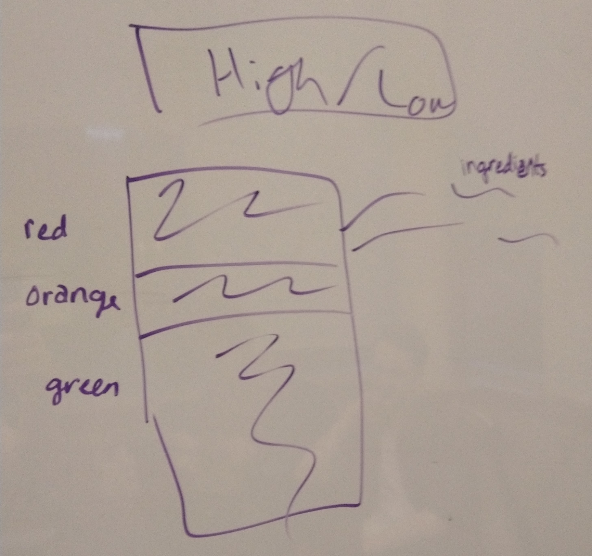
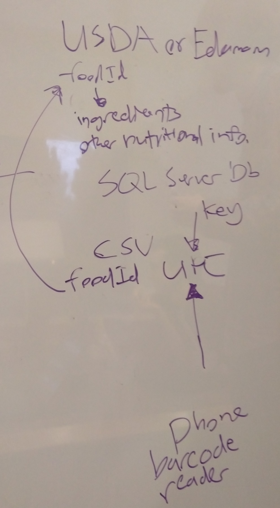

FODMapper Project Inception
=====================================

## Summary of Our Approach to Software Development

We will take a database first approach and focus on responsive and scalable design. We will prioritize high value features and layer on detail through multiple sprints.

## Initial Vision Discussion with Stakeholders

For people suffering from IBS, FODMAP foods and aggravate their symptoms. It can be hard to tell, especially with highly processed foods, what the FODMAP content is and how likely the food is to aggravate IBS. Our product aims to help people with IBS identify which foods are safe to eat.

The product is centered around three core features:

1. There will be an algorithm that ranks the FODMAP content of a food and takes into account the amount of FODMAP ingredients as well as user specified foods.
2. By creating an account, users will be able to designate foods that aggravate their symptoms or foods that they don't have trouble with so that the algorithm can be tailored to the specific individual. The login will also permit users to save lists of what foods they can eat safely which they can export into a printable grocery list or sort by nutrition.
3. Users will be able to scan barcodes at the store to find out the FODMAP content of a food when they are at a store. This will be done through a barcode API and be incorporated into a mobile app.

## Initial Requirements Elaboration and Elicitation

### Interviews
1. *Do we care about people being able change languages on the site?*
      * Not yet, the language of the site will be English
2. *Are we assuming the user has knowledge of FODMAPs and IBS prior to using the site?* 
      * There should be information pages with basic explanations for users who don't have prior knowledge. There should also be links to other sources of information on that page.
3. *What are the important considerations when creating the algorithm?* 
      * The algorithm should incorporate ingredient amounts, and user inputted high and low risk foods.
4. *How will the website be monetized?*
      * The website will be free to use, there will be ads eventually but it is not a priority. There should also be place for users to donate money to the page/development team.

## Full Vision Statement

For people suffering from Irritable Bowel Syndrome who want to conveniently determine if the foods they are choosing to buy or consume will impact them negatively, the FODfinder website is a web-based application that will allow users to explore foods, both generic and from well-known name brands, and determine whether they are suitable for their diet. Using a proprietary algorithm, foods will be automatically ranked from low to high FODMAP content based on their ingredients, which are checked against a database containing hundreds of ingredients from well-established sources. In addition, registered users will be able to input additional ingredients that they've found to be problematic in their experience. For extra convenience, a mobile android application will also be integrated so that users can scan barcodes in store and get a quick score for foods they're unsure about. Unlike other nutritional databases, our product will specialize in just one dietary need, as opposed to other sites that cast a wide net and provide marginal support for several diets.

## List of Needs and Features

1. A clean, nice looking site that is easily navigable with a serene and professional style. Features should be easy to find and the site should have information pages for visitors who want to learn more about IBS, FODMAPs, our algorithm, etc. Visitors to the site should be able to search for foods from an external database like USDA and/or other databases and APIs. There should be a detailed page dynamically generated for each food. If a food is not in the database, there should be a notification that the food could not be found and a list of common FODMAP ingredients to look out for. Visitors should also be able to contact the development team to send feedback on features. Since the application will be entirely free to use, there should also be an area for users who have benefitted from the site to express their gratitude to the developers by sending them money. This area should say something cute and non-aggressive like "Like our website? Buy us a coffee".
2. Users will be able to log in and tag foods as being either higher or lower risk for triggering symptoms for them specifically. A logged in user will be able to make lists of foods that are safe to eat which they can then sort by major food groups, and export as a grocery list. When a user searches for a food, an algorithm will rank the food based on analysis of the ingredients pulled from the USDA database. The algorithm should factor in the amounts of high FODMAPs ingredients, as well as user specified high or low risk foods. Visitors will be able to search for a food and the algorithm will return an overall ranking for the food and a visual representation of the breakdown (for example a pie chart that is color coded) so there is some transparency in how the food is analyzed.
3. There will be a barcode scanner so that users can analyze foods while they are out shopping. It is especially important that this component of the web application has a scalable design since mobile will be the most likely platform this feature would be used on. The barcode scanned should automatically find the food in the database and use the algorithm to analyze the food returning the same results as if the user had searched for it. There will be  a companion mobile app that will emphasize features that users will be more likely to use on the go like the barcode scanner. All features and content should be easy to use on the mobile app.
4. The more users log foods into the site the "smarter" the site should become. The application should look for trends across both a large scale and an individual scale. It should identify trends in foods marked higher risk by a specific user to predict other foods which may be high risk. On the large scale, it should also be able to identify overall trends within demographics such as gender, ethnicity, and age about high risk foods. Additionally, if many users log a food as high risk, a food that currently is not considered a FODMAP, the site should "discover" this food and incorporate it into the algorithm as well as notify the developers that a new FODMAP food as been discovered.

## Initial Modeling

### Mind Map

### Visual Representation of Ranking

### Routing for a Barcode Scanner

## Identify Non-Functional Requirements

1. User accounts and data must be stored indefinitely.  They don't want to delete; rather, mark items as "deleted" but don't actually delete them.  They also used the word "inactive" as a synonym for deleted.
2. Passwords should not expire
3. Site should never return debug error pages.  Web server should have a custom 404 page that is cute or funny and has a link to the main index page.
5. English will be the default language.
6. All styling will be done with Bootstrap 4 when possible.
7. Pages will be designed with HTML 5.
8. Only data critical to the user experience will be stored, and no user data will be shared with outside resources.
9. In order to render the initial state of React components server side, a javascript engine is required to be installed on the web app server.
10. Navigation between pages create a fluid user experience.
11. Styling of website uses calming colors.

## Identify Functional Requirements (User Stories)

E: Epic  
U: User Story  
T: Task  

1. [E] As a visitor to the site, I want to find information about IBS, FODMAPs, and other relevant things so I can understand the context for this website.
   1. [U] As a visitor, I want to find information about IBS so I can learn about what it is.
   2. [U] As a visitor, I want to find information about FODMAPs so I understand why this website exists.
2. [E] As a visitor, I want to search for a food so I can see a detailed page with the nutritional information and ingredients.
   1. [U] As a user, I want to be able to search for a food from a reputable source so I know I am getting valid information.
   2. [U] As a user, I want to see ingredients for a food, so I can look up specific ingredients I have concerns about.
   3. [U] As a user, I want dynamic nutrition labels so I can see the nutrition information for different serving sizes. 
3. [E] As a visitor, I want to search for a specific ingredient so I can see if it is high FODMAPs and why it is high FODMAPS.
   1. [U] As a visitor, I want to search for an ingredient so I can see what level of FODMAPs it is.
   2. [U] As a visitor, I want to see a breakdown of the ingredient so I understand why it is high or low FODMAPs
   3. [U] As a visitor, I want a page of common FODMAPs ingredients too look out for, so I can analyze foods myself.
4. [E] As a user, I want to give feedback to the site so I can make suggestions or give monetary support.
   1. [U] As a user, I want to contact the developers, so I can complain about the lack of features.
   2. [U] As a user, I want to monetarily support the website/development team, so that I can express my appreciation for the value of their product.
5. [E] As a user, I would like the food search to specifically identify FODMAP ingredients so I know what to look out for.
6. [E] As a user, I would like the food search to show an overall ranking of the food's risk so that I can easily interpret results at a glance.
7. [E] As a user, I would like to be able to mark foods as being specifically high risk to me.
8. [E] As a user, I would like the food ranking algorithm to also take into consideration foods that I've manually specified to be less or more aggravating to my IBS symptoms as well as foods I'm just trying to avoid. 
9. [E] As a user, I would like to be able to save foods that are safe for me to eat so I can see them broken down by food group.
10. [E] As a user, I want the option to publicly list my saved foods on my profile so that other people trying to cook for me can get an idea of what foods I can and can't eat
11. [E] transparency in algorithm
      1. [U] visual representation color coded breakdow
      2. [U] show specific ingrediants
      3. [U] algorithm info page
12. [E] As a visitor, I would like to be able to search for a food item by it's UPC code just as easily as a text search, so that I can conveniently and quickly locate information pertaining to a food I am considering consuming.
13. [E] As a mobile visitor, I would like to have the option to scan the barcode of a food item and view details about it on a convenient mobile app so that I can quickly determine whether or not I should purchase a food based on its FODMAP content.
14. [E] As a user, I want to be able to save foods and ingredients to a named list, then later print a list of these in a printer-friendly format so that I can easily locate them while shopping for groceries. 
15. [E] As a mobile user, I would like to be able to quickly save food items on my mobile device and have items I've saved displayed back in a visually pleasing format so that I can look at these at my convenience as use them as a quick reference in various circumstances.
16. [E] As a mobile visitor, I would like to be able to search for a food by it's name so that I can get quick, convenient feedback on foods I'm curious about. 
16. [E] As a user, I would like to optionally have my personal food sensitivities analyzed along with those of other users in a statistical context so that I can continually get the best recommendations about which foods or ingredients to potentially avoid.  
17. [E] As a user, I would like foods that I've specified to be aggravating to my symptoms to be considered in future calculations of food suitability so that I can get feedback that is the most personally applicable to my needs.
18. [E] As a user, I want any statistical calculations made based on my food preference data to be compared in a meaningful way with that of other people in the same or similar demographics to me so that I can be assured that the feedback I'm getting is the most applicable to people like me.
19. [E] As a user, I would like my personal input on different foods to work towards the discovery of new FODMAP foods so that the results for everyone using the web application are the most current and thoroughly-tested
20. [E] As a visitor, I want to see a cute, but informative 404 page in case I make a wrong turn or type a url incorrectly so that I'll be able to easily find my way back to a useful page and not feel lost

## Initial Architecture Envisioning
(To be completed)

## Agile Data Modeling
(To be completed)

## Timeline and Release Plan
(To be completed)

